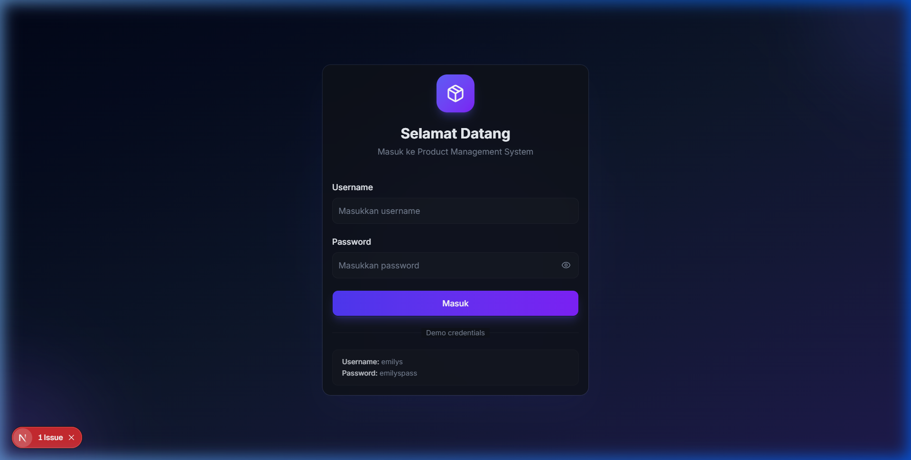
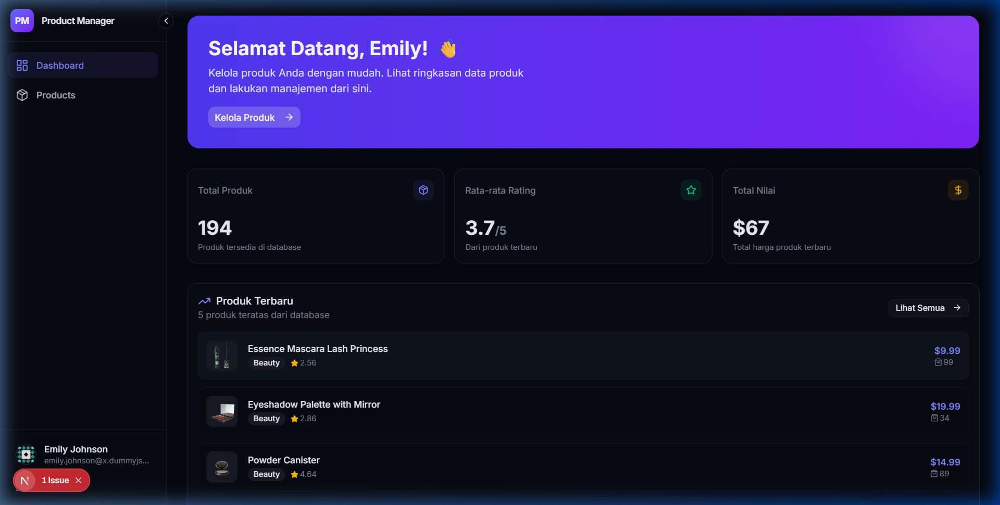
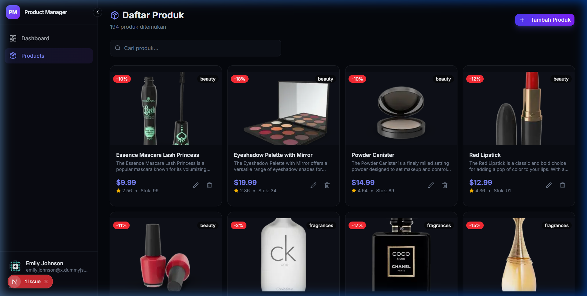
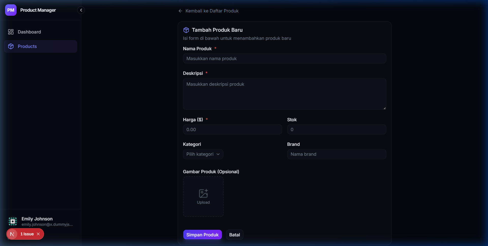

# 📦 Product Management System

Aplikasi Manajemen Produk berbasis web menggunakan **Next.js 15 + TypeScript + shadcn/ui + Tailwind CSS**, dengan data dari [DummyJSON API](https://dummyjson.com).

## ✨ Fitur

- 🔐 **Autentikasi** — Login dengan validasi, token di localStorage, proteksi halaman
- 🏠 **Dashboard** — Statistik produk, rating, dan daftar produk terbaru
- 📦 **CRUD Produk** — Create, Read, Update, Delete dengan search & pagination
- 🖼️ **Upload Gambar** — Preview gambar client-side (opsional)
- 🎨 **UI Modern** — Dark theme premium, glassmorphism, responsive sidebar
- 📱 **PWA Ready** — Manifest untuk Progressive Web App

## 🛠️ Tech Stack

| Teknologi | Versi |
|-----------|-------|
| Next.js | 15 (App Router) |
| React | 19 |
| TypeScript | 5 |
| Tailwind CSS | 4 |
| shadcn/ui | 4 (base-ui) |
| Lucide Icons | latest |

## 🚀 Cara Menjalankan

### Prerequisites

- **Node.js** >= 18.x
- **npm** >= 9.x

### Langkah-langkah

1. **Clone repository**
   ```bash
   git clone <URL_REPOSITORY>
   cd product-management
   ```

2. **Install dependencies**
   ```bash
   npm install
   ```

3. **Jalankan development server**
   ```bash
   npm run dev
   ```

4. **Buka di browser**
   ```
   http://localhost:3000
   ```

5. **Login dengan akun demo**
   ```
   Username: emilys
   Password: emilyspass
   ```

### Build Production

```bash
npm run build
npm start
```

## 📁 Struktur Folder

```
src/
├── app/                    # Pages (App Router)
│   ├── login/              # Halaman login
│   ├── dashboard/          # Halaman dashboard
│   └── products/           # Halaman CRUD produk
│       ├── create/         # Form tambah produk
│       └── [id]/edit/      # Form edit produk
├── components/
│   ├── layout/             # Sidebar, Dashboard Layout
│   ├── ui/                 # shadcn/ui components
│   ├── protected-route.tsx # Guard autentikasi
│   └── delete-dialog.tsx   # Dialog konfirmasi hapus
├── context/
│   └── auth-context.tsx    # State management autentikasi
└── lib/
    ├── api.ts              # HTTP client + error handling
    ├── auth.ts             # Service autentikasi
    ├── products.ts         # Service CRUD produk
    └── utils.ts            # Utility functions
```

## 🔗 API Endpoints (DummyJSON)

| Method | Endpoint | Fungsi |
|--------|----------|--------|
| POST | `/auth/login` | Login |
| GET | `/auth/me` | Get current user |
| GET | `/products` | List produk |
| GET | `/products/search?q=` | Search produk |
| POST | `/products/add` | Tambah produk |
| PUT | `/products/{id}` | Update produk |
| DELETE | `/products/{id}` | Hapus produk |

## 📸 Screenshot

### Login Page


### Dashboard


### Daftar Produk


### Tambah/Edit Produk

